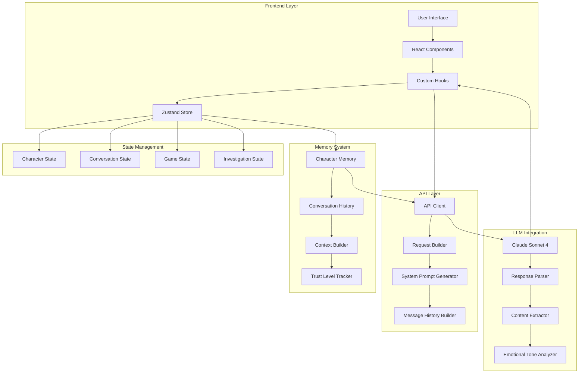

# 🤖 Technical Implementation Guide
## Chat System Architecture & LLM Integration Flow

---

## 📋 Table of Contents
1. [System Overview](#system-overview)
2. [Architecture Diagram](#architecture-diagram)
3. [LLM Integration Flow](#llm-integration-flow)
4. [State Management](#state-management)
5. [API Communication](#api-communication)
6. [Character System](#character-system)
7. [Memory & Context Management](#memory--context-management)
8. [Message Processing Pipeline](#message-processing-pipeline)
9. [Error Handling & Recovery](#error-handling--recovery)
10. [Performance Optimizations](#performance-optimizations)
11. [Security Implementation](#security-implementation)
12. [Integration Patterns](#integration-patterns)

---

## 🏗️ System Overview

The chat system is built as a **modular, state-driven architecture** that integrates with Claude Sonnet 4 via a custom API endpoint. It maintains persistent character memories, manages conversation contexts, and provides real-time interactive experiences.

### **Core Components:**
- **Frontend**: Next.js 14 with TypeScript
- **State Management**: Zustand with persistence
- **LLM Integration**: Claude Sonnet 4 via custom API
- **Memory System**: Character-specific conversation history
- **UI Framework**: React with Framer Motion animations

---

## 🎯 Architecture Diagram



---

## 🔄 LLM Integration Flow

### **1. User Input Processing**
```typescript
// User types message → Input validation → State update
const sendMessage = async (content: string) => {
  // 1. Validate input
  if (!content.trim() || content.length > 500) {
    setError('Message must be between 1 and 500 characters');
    return;
  }

  // 2. Create user message
  const userMessage: Message = {
    id: `user-${Date.now()}-${Math.random().toString(36).substr(2, 9)}`,
    characterId: currentCharacter.id,
    content: content.trim(),
    timestamp: new Date(),
    type: 'user'
  };

  // 3. Add to conversation
  addMessage(currentCharacter.id, userMessage);
  setTyping(true);
};
```

### **2. Context Building**
```typescript
// Build comprehensive context for LLM
const buildSystemPrompt = (character: Character, context: any): string => {
  return `You are ${character.name}, ${character.role} in the Blackwood Manor murder mystery.

DETECTIVE CONTEXT:
- You are being interviewed by Detective Sarah Chen
- Always address her as "Detective Chen" or "Detective Sarah Chen"
- Never use "sir" - she is a female detective

PERSONALITY: ${character.personality.join(', ')}
CURRENT EMOTIONAL STATE: ${character.currentEmotionalState}
TRUST LEVEL: ${character.trustLevel}/100

BACKGROUND: ${character.backstory}
SECRETS YOU KNOW: ${character.secrets.join(', ')}

// ... additional context including relationships, 
// investigation progress, revealed information, etc.
`;
};
```

### **3. API Request Construction**
```typescript
// Build structured request for Claude API
const request: ClaudeAPIRequest = {
  system: [{ text: systemPrompt }],
  messages: [
    // Previous conversation history (last 10 messages)
    ...conversationHistory.slice(-10).map(msg => ({
      role: msg.type === 'user' ? 'user' : 'assistant',
      content: [{ text: msg.content }]
    })),
    // Current user message
    {
      role: 'user',
      content: [{ text: userMessage }]
    }
  ],
  model: 'claude-4-sonnet'
};
```

### **4. LLM Response Processing**
```typescript
// Process Claude's response
const response = await ClaudeAPI.generateCharacterResponse(
  character, userMessage, conversationHistory, characterMemory
);

if (response.success && response.data) {
  // Extract response content from nested API structure
  const responseContent = response.data.data?.output?.message?.content?.[0]?.text || 
    response.data.content?.[0]?.text || 
    response.data.message || 
    "I'm not sure how to respond to that.";

  // Create character message with emotional analysis
  const characterMessage: Message = {
    id: `character-${Date.now()}-${Math.random().toString(36).substr(2, 9)}`,
    characterId: character.id,
    content: responseContent.trim(),
    timestamp: new Date(),
    type: 'character',
    emotionalTone: determineEmotionalTone(responseContent, character)
  };
}
```

---

## 🗄️ State Management

### **Zustand Store Architecture**
```typescript
interface ChatStore {
  // Current state
  currentCharacter: Character | null;
  conversations: Record<string, Conversation>;
  isTyping: boolean;
  
  // Investigation state
  investigationState: InvestigationState;
  gameState: GameState;
  
  // Actions
  setCurrentCharacter: (character: Character | null) => void;
  addMessage: (characterId: string, message: Message) => void;
  updateCharacterMemory: (characterId: string, updates: Partial<Character>) => void;
  // ... more actions
}
```

### **State Persistence**
```typescript
// Automatic persistence with rehydration
export const useChatStore = create<ChatStore>()(
  persist(
    (set, get) => ({
      // Store implementation
    }),
    {
      name: 'blackwood-chat-storage',
      onRehydrateStorage: () => (state) => {
        if (state) {
          // Convert timestamp strings back to Date objects
          Object.values(state.conversations).forEach(conversation => {
            conversation.messages.forEach(message => {
              if (typeof message.timestamp === 'string') {
                message.timestamp = new Date(message.timestamp);
              }
            });
          });
        }
      }
    }
  )
);
```

---

## 🔌 API Communication

### **Request Flow**
```typescript
class ClaudeAPI {
  private static async makeRequest(request: ClaudeAPIRequest): Promise<APIResponse> {
    try {
      // 1. Add timeout to prevent hanging requests
      const controller = new AbortController();
      const timeoutId = setTimeout(() => controller.abort(), 30000);

      // 2. Make API request
      const response = await fetch(API_BASE_URL, {
        method: 'POST',
        headers: {
          'Content-Type': 'application/json',
          'Authorization': `Bearer ${BEARER_TOKEN}`,
        },
        body: JSON.stringify(request),
        signal: controller.signal
      });

      clearTimeout(timeoutId);

      // 3. Handle response
      if (!response.ok) {
        throw new Error(`API request failed: ${response.status}`);
      }

      const data = await response.json();
      return { success: true, data };
    } catch (error) {
      // 4. Error handling
      return { success: false, error: error.message };
    }
  }
}
```

### **Response Structure**
```typescript
// Expected API response format
interface APIResponse {
  success: boolean;
  data?: {
    data: {
      output: {
        message: {
          content: [{ text: string }]
        }
      }
    }
  };
  error?: string;
}
```

---

## 👥 Character System

### **Character Data Structure**
```typescript
interface Character {
  id: string;
  name: string;
  role: string;
  description: string;
  personality: string[];
  primaryEmotions: string[];
  responsePatterns: {
    initial: string;
    defensive: string;
    selfPitying: string;
    manipulative: string;
    breakdown: string;
  };
  knowledgeBase: string[];
  emotionalTriggers: string[];
  informationSharing: {
    willing: string[];
    reluctant: string[];
    willNot: string[];
    mustBePressed: string[];
  };
  color: string;
  avatar: string;
  backstory: string;
  secrets: string[];
  relationships: Record<string, string>;
  currentEmotionalState: 'neutral' | 'defensive' | 'aggressive' | 'vulnerable' | 'manipulative';
  trustLevel: number; // 0-100
  revealedSecrets: string[];
}
```

### **Character Memory Management**
```typescript
// Update character memory based on conversation
updateCharacterMemory(characterId, {
  trustLevel: Math.min(100, (characterMemory?.trustLevel || 20) + 1),
  conversationDepth: (characterMemory?.conversationDepth || 0) + 1,
  lastInteraction: new Date()
});
```

---

## 🧠 Memory & Context Management

### **Conversation Context**
```typescript
interface ConversationContext {
  currentTopic: string;
  emotionalState: string;
  revealedInformation: string[];
  investigationClues: string[];
  characterMood: string;
  conversationDepth: number;
  trustLevel: number;
  lastInteraction: Date;
}
```

### **Context Building Process**
1. **Character Selection** → Load character memory
2. **Message History** → Retrieve last 10 messages
3. **Investigation State** → Current progress and evidence
4. **Relationship Data** → Character relationships and trust levels
5. **Victim Information** → Victoria Blackwood's data as context

### **Memory Persistence**
```typescript
// Each character maintains separate conversation history
conversations: {
  'james-blackwood': {
    id: 'conv-1',
    characterId: 'james-blackwood',
    messages: [...],
    startedAt: Date,
    lastMessageAt: Date,
    context: ConversationContext
  },
  'elena-rodriguez': {
    // Separate conversation for Elena
  }
}
```

---

## ⚡ Message Processing Pipeline

### **1. Input Validation**
```typescript
// Validate user input
if (!content.trim() || content.length > 500) {
  setError('Message must be between 1 and 500 characters');
  return;
}
```

### **2. Message Creation**
```typescript
// Create structured message
const userMessage: Message = {
  id: `user-${Date.now()}-${Math.random().toString(36).substr(2, 9)}`,
  characterId: currentCharacter.id,
  content: content.trim(),
  timestamp: new Date(),
  type: 'user'
};
```

### **3. Context Assembly**
```typescript
// Build comprehensive context
const systemPrompt = buildSystemPrompt(character, {
  currentTopic: 'general',
  investigationProgress: gameState.investigationProgress,
  relationshipScore: characterMemory?.trustLevel || 0,
  revealedInformation: characterMemory?.revealedSecrets || []
});
```

### **4. API Request**
```typescript
// Send to Claude API
const response = await ClaudeAPI.generateCharacterResponse(
  character, userMessage, conversationHistory, characterMemory
);
```

### **5. Response Processing**
```typescript
// Extract and process response
const responseContent = extractResponseContent(response);
const emotionalTone = determineEmotionalTone(responseContent, character);
const characterMessage = createCharacterMessage(responseContent, emotionalTone);
```

### **6. State Updates**
```typescript
// Update all relevant state
addMessage(characterId, characterMessage);
updateCharacterMemory(characterId, newMemoryData);
checkForEvidence(responseContent);
updateInvestigationProgress();
```

---

## 🛡️ Error Handling & Recovery

### **Error Types Handled**
1. **Network Errors** - API timeouts, connection failures
2. **API Errors** - Invalid responses, authentication failures
3. **Input Errors** - Invalid user input, length violations
4. **State Errors** - Corrupted state, missing data
5. **UI Errors** - Component crashes, rendering issues

### **Error Recovery Strategies**
```typescript
// 1. API Timeout Handling
const controller = new AbortController();
const timeoutId = setTimeout(() => controller.abort(), 30000);

// 2. Graceful Degradation
if (response.success && response.data) {
  // Process response
} else {
  // Show user-friendly error message
  const errorMessage: Message = {
    id: `error-${Date.now()}`,
    characterId: currentCharacter.id,
    content: "I'm having trouble responding right now. Please try again.",
    timestamp: new Date(),
    type: 'system'
  };
  addMessage(currentCharacter.id, errorMessage);
}

// 3. Error Boundaries
<ErrorBoundary>
  <ChatContainer messages={messages} />
</ErrorBoundary>
```

---

## 🚀 Performance Optimizations

### **1. Message ID Collision Prevention**
```typescript
// Unique IDs with timestamp + random component
id: `user-${Date.now()}-${Math.random().toString(36).substr(2, 9)}`
```

### **2. Conversation History Limiting**
```typescript
// Keep only last 10 messages for context
const messages = conversationHistory.slice(-10);
```

### **3. State Update Optimization**
```typescript
// Batch state updates
set((state) => ({
  conversations: {
    ...state.conversations,
    [characterId]: updatedConversation
  },
  isTyping: false
}));
```

### **4. Component Memoization**
```typescript
// Memoize expensive operations
const getCurrentMessages = useCallback(() => {
  if (!currentCharacter) return [];
  return conversations[currentCharacter.id]?.messages || [];
}, [currentCharacter, conversations]);
```

---

## 🔒 Security Implementation

### **1. Input Sanitization**
```typescript
// Validate and sanitize all inputs
if (!content.trim() || content.length > 500) {
  setError('Message must be between 1 and 500 characters');
  return;
}
```

### **2. XSS Prevention**
```typescript
// Safe content rendering
<p className="text-sm leading-relaxed whitespace-pre-wrap">
  {message.content}
</p>
```

### **3. API Security**
```typescript
// Secure API communication
headers: {
  'Content-Type': 'application/json',
  'Authorization': `Bearer ${BEARER_TOKEN}`,
}
```

### **4. Data Privacy**
```typescript
// Local storage only, no sensitive data exposure
// All data stays in browser, no server-side storage
```

---

## 🎮 Integration Patterns

### **Pattern 1: Standalone Chat System**
```typescript
// Full investigation mode
<ChatSystem 
  characters={allCharacters}
  onCharacterSelect={handleCharacterSelect}
  onMessageSend={handleMessageSend}
/>
```

### **Pattern 2: Individual Character Interaction**
```typescript
// Single character encounter
<CharacterEncounter 
  characterId="james-blackwood"
  onConversationEnd={handleConversationEnd}
/>
```

### **Pattern 3: Location-Based Chat**
```typescript
// Room-specific interactions
<LocationChat 
  location="library"
  availableCharacters={libraryCharacters}
  context={locationContext}
/>
```

### **Pattern 4: Story-Triggered Chat**
```typescript
// Cutscene-triggered conversation
<StoryChat 
  characterId="elena-rodriguez"
  storyContext={currentStoryBeat}
  onStoryProgress={handleStoryProgress}
/>
```

---

## 🔧 Configuration & Customization

### **Environment Variables**
```bash
# API Configuration
NEXT_PUBLIC_API_BASE_URL=https://api-relay.applied-ai.zynga.com/v0/chat/low_level_converse
NEXT_PUBLIC_API_TOKEN=your_bearer_token_here

# Game Configuration
NEXT_PUBLIC_GAME_TITLE=Blackwood Manor Investigation
NEXT_PUBLIC_DETECTIVE_NAME=Detective Sarah Chen
```

### **Character Customization**
```typescript
// Add new characters in lib/characters.ts
export const characters: Character[] = [
  {
    id: 'new-character',
    name: 'New Character',
    role: 'Custom Role',
    personality: ['trait1', 'trait2'],
    // ... other properties
  }
];
```

### **API Endpoint Customization**
```typescript
// Modify lib/api.ts for different LLM providers
const API_BASE_URL = process.env.NEXT_PUBLIC_API_BASE_URL;
const BEARER_TOKEN = process.env.NEXT_PUBLIC_API_TOKEN;
```

---

## 📊 Monitoring & Debugging

### **Debug Features**
```typescript
// Development-only logging
if (process.env.NODE_ENV === 'development') {
  console.log('API Request:', request);
  console.log('API Response:', response);
}
```

### **Error Tracking**
```typescript
// Comprehensive error logging
console.error('❌ API Error:', response.status, response.statusText);
console.error('❌ Error details:', errorText);
```

### **Performance Monitoring**
```typescript
// Track conversation metrics
const conversationMetrics = {
  messageCount: messages.length,
  averageResponseTime: calculateAverageResponseTime(),
  characterEngagement: calculateEngagementScore()
};
```

---

## 🎯 Best Practices

### **1. Message Handling**
- Always validate input before processing
- Use unique IDs to prevent collisions
- Implement proper error handling
- Provide user feedback for all actions

### **2. State Management**
- Keep state updates atomic
- Use proper TypeScript types
- Implement state persistence correctly
- Handle state corruption gracefully

### **3. API Integration**
- Implement timeout handling
- Provide fallback responses
- Log errors for debugging
- Handle rate limiting

### **4. Performance**
- Limit conversation history
- Use proper memoization
- Optimize re-renders
- Implement lazy loading

---

## 🚀 Deployment Considerations

### **Production Build**
```bash
# Build for production
npm run build

# Start production server
npm start
```

### **Environment Setup**
```bash
# Copy environment template
cp env.example .env.local

# Configure production settings
NODE_ENV=production
NEXT_PUBLIC_API_BASE_URL=your_production_endpoint
```

### **Performance Monitoring**
- Monitor API response times
- Track error rates
- Monitor memory usage
- Analyze user engagement

---

## 📈 Future Enhancements

### **Potential Improvements**
1. **Voice Integration** - Speech-to-text and text-to-speech
2. **Multi-language Support** - Internationalization
3. **Advanced Analytics** - Conversation insights
4. **Real-time Collaboration** - Multiple detectives
5. **AI Model Switching** - Support for different LLMs

### **Scalability Considerations**
1. **Database Integration** - For larger conversation histories
2. **Caching Layer** - Redis for frequently accessed data
3. **Load Balancing** - For high-traffic scenarios
4. **CDN Integration** - For static assets

---

**This technical implementation provides a robust, scalable, and maintainable chat system ready for professional game integration! 🎮✨**
